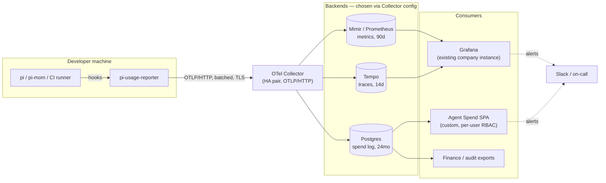
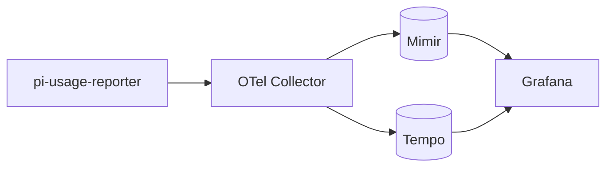
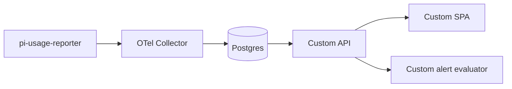
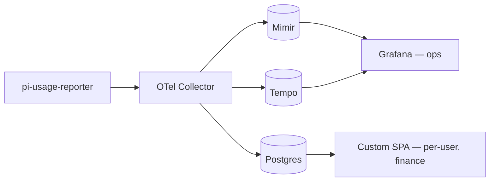
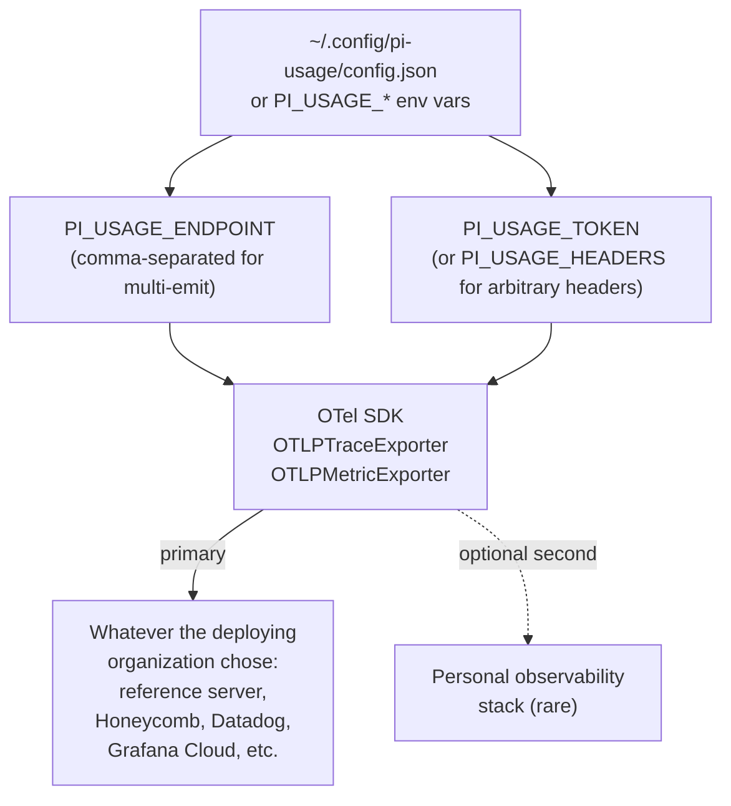
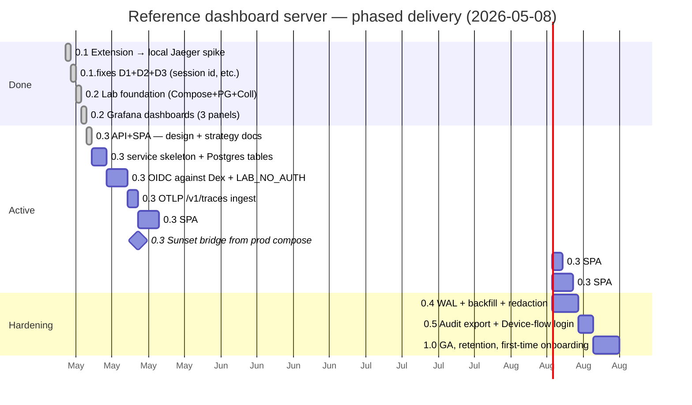
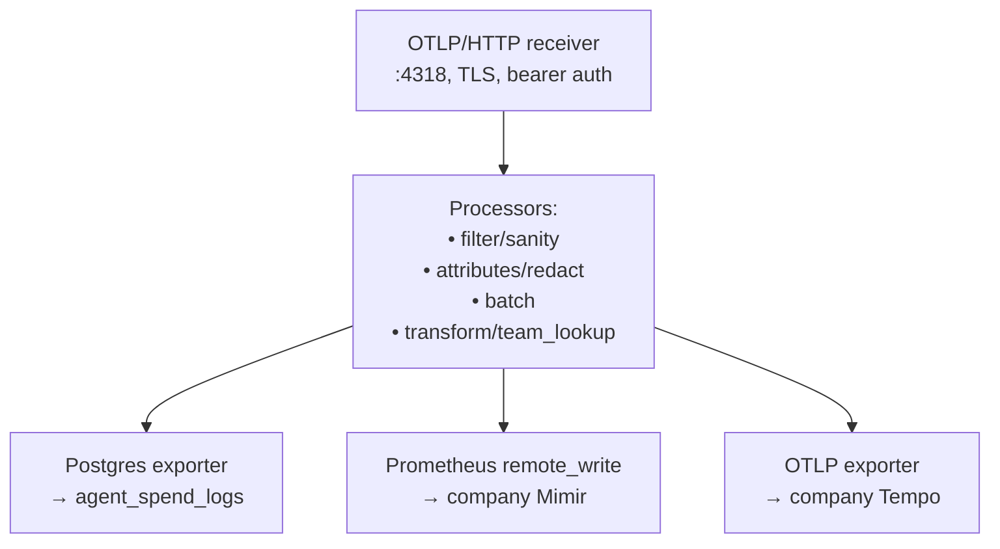

# Reference Dashboard Server — Backend Architecture Strategy

**Document type:** Strategy
**Status:** Accepted
**Date:** 2026-05-08
**Owner:** Platform / DevEx
**Workspace:** `pi-dev`
**Related:** [`scope-and-deployment-STRATEGY.md`](scope-and-deployment-STRATEGY.md), [`pi-extensions-monorepo-STRATEGY.md`](pi-extensions-monorepo-STRATEGY.md), [`../design/pi-usage-reporter-DESIGN.md`](../design/pi-usage-reporter-DESIGN.md)

> **Scope clarification.** Per the [scope and deployment strategy](scope-and-deployment-STRATEGY.md), this document describes the **reference dashboard server** — a future open-source project at `vilosource/agent-spend-dashboard`. It is one of several possible OTLP-compatible backends an organization can point the extension at. **The extension itself is organization-agnostic** and works against Honeycomb, Datadog, Grafana Cloud, a homemade receiver, or this reference server interchangeably. Optiscan's own deployment of the reference server (Docker Swarm + Azure Managed Postgres + company Grafana) is captured in a private Optiscan repo and is out of scope here.

## 1. Decision

The **reference dashboard server** is built around an **OTel Collector that fans out to two backends**, each used for what it is best at:

- **Grafana stack (Mimir / Tempo / Loki)** — operational view, real-time alerting, on-call routing. Wired to whatever Grafana / Mimir / Tempo the deploying organization already runs (or skipped entirely if they don't have one).
- **Postgres** — durable per-turn spend log for finance reconciliation, per-user dashboard, audit export, long-term retention. Connection-string driven; works with any Postgres (managed or self-hosted).

The **extension** itself stays backend-agnostic and emits only OTLP. Switching, adding, or removing a backend is a Collector configuration change on the deploying organization's side — not a code change on every developer's machine.

Every organization-specific value (Grafana URL, Mimir remote-write token, Postgres connection string, IdP, public hostname) is an environment-variable knob in the reference server. There are **no hardcoded URLs, hostnames, or tokens** in either the extension or the reference server.

## 2. The mental model

The pipeline. The extension speaks OTLP; the deploying organization's Collector chooses where the data lands. This diagram shows the recommended Shape 3 (both backends) as it would look for any organization that has a Grafana stack and wants the per-user / finance / audit surface as well.



## 3. Why dual backend instead of one

We considered three shapes. Each is viable; Shape 3 wins because Grafana and Postgres complement each other.

### Shape 1 — Grafana only



**Pros:** uses the deploying organization's existing Grafana; pre-built dashboard JSON shipped with the reference server; alerting and on-call wiring use whatever Grafana Alerting routes the organization already has.
**Cons:** Mimir is a rolling time-series store, not an audit log (default 30-90 day retention; long retention is expensive). PromQL is awkward for relational queries ("top 10 projects by cost this quarter joined to team mapping"). Per-user RBAC ("developer A sees only their own data") is not Grafana's strength — its permissions model is per-folder/per-dashboard, not per-row.

**Best for:** ops view, real-time alerting, team-level rollups.

### Shape 2 — Postgres only



**Pros:** full control over schema, queries, retention, RBAC; one row per turn (perfect for audit and reconciliation); SQL (every analyst already knows it); per-user views are a `WHERE user_id = $1` clause.
**Cons:** we build the UI (~1500 LOC), the alerting (~300 LOC), and operate yet another small service.

**Best for:** finance reconciliation, per-developer/per-team dashboards, compliance, custom views.

### Shape 3 — Both (recommended)



**One emit from the developer machine. Two backends. Each used for what it is good at.**

| Need | Backend |
|---|---|
| "Is anything on fire right now?" | Grafana / Mimir alerts |
| "Which model is our team using most this week?" | Grafana panels |
| "What did developer X spend last month, by project?" | Postgres / SPA |
| "Export every assistant turn in May 2026 with cost and project, as CSV." | Postgres `COPY` |
| "Reconcile our local cost estimate against the Anthropic invoice." | Postgres + finance flow |
| "Show me this specific session's turn-by-turn detail." | Tempo trace + SPA detail page |
| "Alert me when developer Y's hourly burn rate exceeds 2× their 30-day p95." | Either; we will start in the SPA's alert evaluator (more flexible) |

**No duplication on the developer side** — they emit once. **Free A/B switchover** — if one backend breaks or we change tools, the other is unaffected.

This is the same shape large LLM operators converged on, and it matches the official Anthropic recommendation for Claude Code's first-party telemetry path (see [Anthropic CC Analytics docs](https://code.claude.com/docs/en/analytics) and [Sealos' worked example](https://sealos.io/blog/claude-code-metrics/)).

For a deploying organization that has only Grafana, choosing **Shape 1** is fine — they skip the Postgres exporter and lose the per-row / finance views, but the ops view works. For an organization that has neither, **Shape 2** with sqlite-or-Postgres-only is also valid — they lose Grafana panels but get the SPA. The reference server supports all three shapes via configuration.

## 4. What the extension exposes for backend choice

The extension stays single-config-line for normal users. The knobs exist for unusual cases.



A typical developer's config has one endpoint, supplied by their organization:

```bash
PI_USAGE_ENDPOINT=https://<organization-collector-host>
PI_USAGE_TOKEN=<from `pi-usage login`>
```

Multi-endpoint (rare; for personal tinkering):

```bash
PI_USAGE_ENDPOINT=https://<org-collector>,https://otlp-gateway-prod-eu-west-2.grafana.net/otlp
PI_USAGE_HEADERS_1='Authorization=Bearer <org token>'
PI_USAGE_HEADERS_2='Authorization=Basic <grafana cloud token>'
```

99% of developers will never set the second form. It exists so a curious engineer can tee their own data into a personal observability stack without their organization's blessing — explicitly allowed, never required.

## 5. What changes versus a "Postgres-only" reference server

A reference server that ships only Postgres + SPA + custom alerting is viable; it would be roughly equivalent to LiteLLM's UI in shape. Adding Grafana support to the reference server lets a deploying organization that already has Grafana:

1. **Skip the custom alert evaluator.** Use Grafana Alerting + their existing Slack / on-call routing. Saves ~300 LOC and one service to operate.
2. **Defer the "ops view" pages of the SPA.** Real-time burn-rate and team rollup graphs are what Grafana is best at — we ship dashboard JSON in the reference server's repo so any organization can `grafana-cli dashboard import` them.
3. **Get a working dashboard URL fast.** If Grafana is already up, the deploying organization just needs the Collector and a metric flowing.

The SPA's scope shrinks to what only it can do: per-user views, per-developer drill-in, finance exports, RBAC. That is roughly half the SPA work the Postgres-only shape would require.

For an organization without Grafana, the reference server still works in **Shape 2**: Postgres-only, with the SPA's ops pages becoming load-bearing rather than supplementary. Both shapes are supported; the dashboards JSON is just optional.

## 6. Phased delivery (revised again, 2026-05-08)

Updated to reflect actual progress and the [API+SPA design](https://github.com/vilosource/agent-spend-dashboard/blob/main/docs/design/api-and-spa-DESIGN.md). Phases 0.1, 0.2, and the bridge-based ingest are **shipped**. Phase 0.3 (API + SPA + multi-IdP OIDC) is the active work; the bridge sunsets at the end of 0.3 per [D6 in the dashboard's decisions log](https://github.com/vilosource/agent-spend-dashboard/blob/main/docs/strategy/decisions-LOG.md).



What's already shipped:

- **0.1 spike**: extension loads in pi, emits 27 attributes to Jaeger end-to-end. (`vilosource/pi-extensions` commit `0fb4623`)
- **0.1 follow-up**: D1 (session id), D2 (subscription cost classification), D3 (harness version) all fixed.
- **0.2 lab foundation**: Compose stack, agent_spend_logs schema, OTel Collector, Python bridge, synthetic seeder. (`vilosource/agent-spend-dashboard` commit `7d936a5`)
- **0.2 Grafana**: three pre-built dashboards (Org Overview, By Team, Burn Rate) provisioned and visible at `http://localhost:7000`. (`88786de`)

What's active:

- **0.3 API + SPA**: detailed design landed [here](https://github.com/vilosource/agent-spend-dashboard/blob/main/docs/design/api-and-spa-DESIGN.md); implementation phased over ~25 working days. The path from "OIDC works" to "I can see my own data on the SPA" is the first 8 days of that phase.

**The original "Grafana first" sequencing held up.** The Grafana dashboards are real and useful right now without the SPA existing; the SPA and Grafana then ship complementarily, never competing. Per [D5 in the dashboard's decisions log](https://github.com/vilosource/agent-spend-dashboard/blob/main/docs/strategy/decisions-LOG.md), the SPA covers per-user RBAC, finance exports, audit — the things Grafana cannot do. Grafana keeps the org/team/ops view.

## 7. Caveats, called out explicitly

Grafana is **not** the right tool for these specific needs, no matter how good the dashboards look. These drive the SPA and Postgres existing alongside Grafana in the reference server, not replacing it.

| Limitation of Grafana for this use case | Why we still need Postgres + SPA |
|---|---|
| Per-row, per-user RBAC | Grafana permissions are per-folder/per-dashboard, not per-row. "Developer A sees only their own data" requires Postgres + a custom view. |
| Long-term retention | Mimir at default retention will not have data from 18 months ago. Tuning retention up across the company stack for our use case is a conversation we should not block on. Postgres stores 24 months hot, S3 archive after that, cheaply. |
| Finance-grade per-row export | Grafana CSV from Prometheus is awkward (you are exporting aggregates). Postgres `COPY` does it in one command. |
| Joining to org-managed tables | We have user / team / budget / cost-center tables that live next to the spend log in Postgres. Joining those in PromQL is impossible; in SQL it is one query. |
| Reconciliation against provider invoices | Same — finance flow is SQL-shaped, not metrics-shaped. |

## 8. What this means for the Collector configuration

The Collector pipeline gains exporters for both backends. The extension does not change.



Concrete YAML lives in the design doc (§4). The point here: each exporter is independently enable/disable-able. We can run Shape 1 today (drop the Postgres exporter), Shape 3 next month (re-enable it), Shape 2 if Grafana ever goes away (drop Mimir and Tempo). **Same extension, same wire format.**

## 9. Decisions this document commits to

1. **Wire format:** OTLP/HTTP only. The extension never speaks anything else.
2. **Reference server defaults to Shape 3:** Mimir + Tempo + Postgres. Shape 1 (Grafana only) and Shape 2 (Postgres only) are also supported via configuration.
3. **The reference server uses the deploying organization's existing Grafana** when one is present. It never operates its own Grafana instance.
4. **Grafana dashboards shipped as JSON in the reference server's repo.** Any organization can `grafana-cli dashboard import` them.
5. **Grafana Alerting handles real-time burn-rate and budget alerts** for v1 in deployments that have it, routed through whatever Slack / on-call the deploying organization already uses. A custom alert evaluator is deferred until there is a documented need Grafana can't meet.
6. **SPA scope is per-user, per-team, per-project, finance, audit.** Not ops dashboards (Grafana owns those when present; the SPA promotes its ops surface only in deployments without Grafana).
7. **Multi-endpoint emit allowed but unadvertised.** `PI_USAGE_ENDPOINT` accepts a comma-separated list; the typical case is one endpoint chosen by the deploying organization.
8. **Backend choice is a Collector config change, never an extension change.** Reference-server exporters documented: Postgres, Prometheus remote_write, OTLP (for Tempo, Honeycomb, Datadog, etc.). The extension does not know which the organization picked.
9. **Order of delivery for organizations that have Grafana: Grafana first, Postgres + SPA second.** For organizations without, start at Postgres + SPA. Either path is supported by the same reference server.
10. **No metrics duplicated to multiple stores.** Each metric lives in exactly one of Mimir or Postgres (it's the same data, but different aggregation grain — Mimir holds histogram aggregates, Postgres holds per-row events). The dashboards are designed so a question is answered by exactly one backend.
11. **No organization-specific values in the reference server source.** Every URL, token, and identifier is environment-variable driven. CI validates this.
