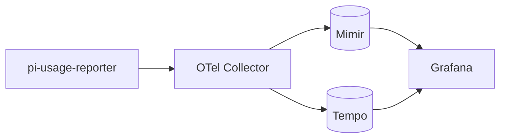
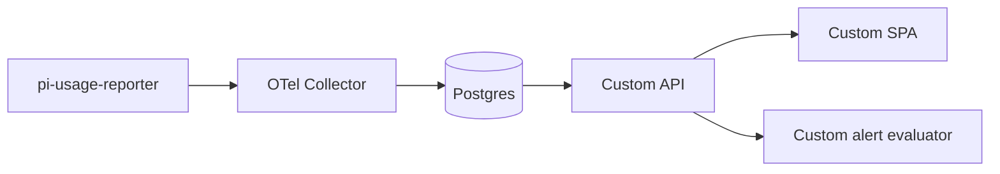
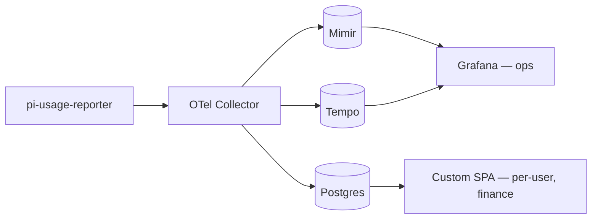
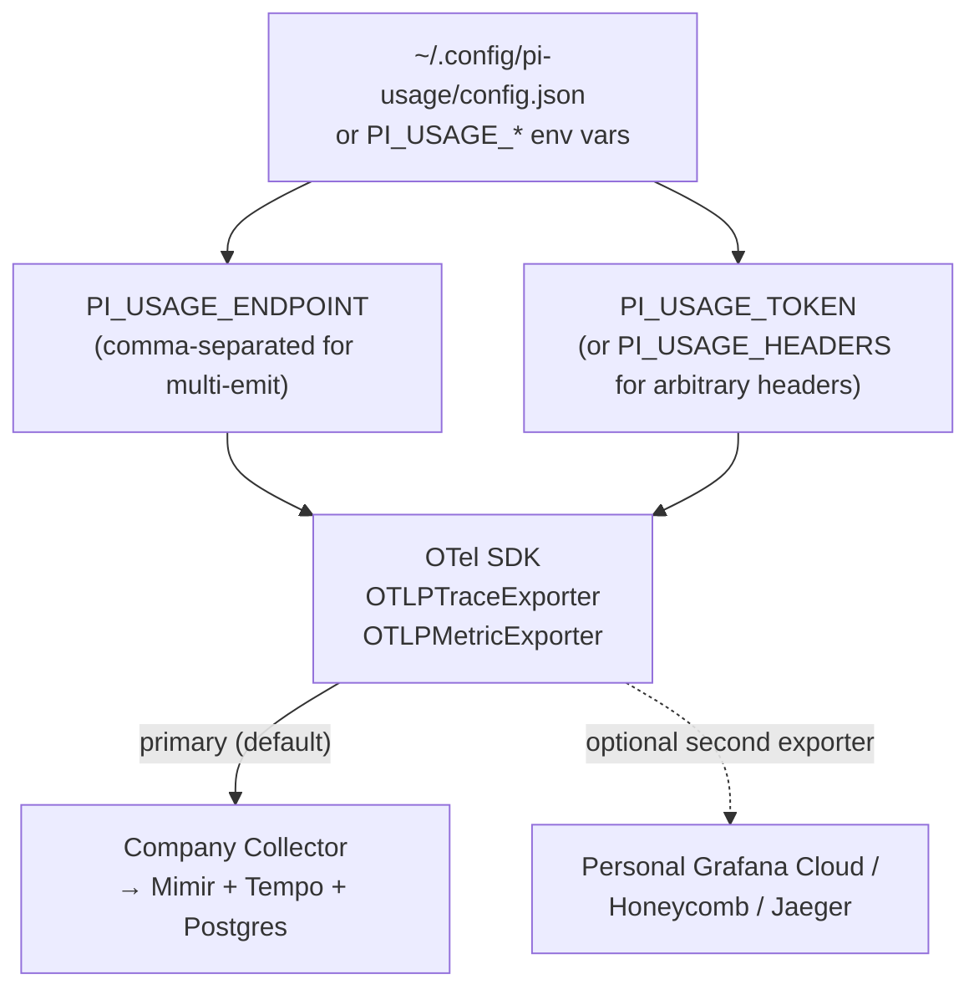
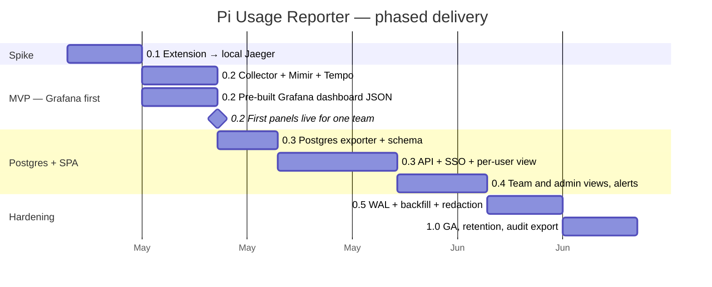
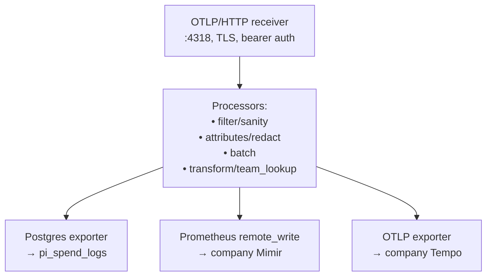

# Dashboard Backend Strategy — Grafana + Postgres Dual Backend

**Document type:** Strategy
**Status:** Accepted
**Date:** 2026-05-08
**Owner:** Platform / DevEx
**Workspace:** `pi-dev`
**Related:** [`pi-extensions-monorepo-STRATEGY.md`](pi-extensions-monorepo-STRATEGY.md), the upcoming `docs/design/pi-usage-reporter-DESIGN.md`

## 1. Decision

The `pi-usage-reporter` extension emits OpenTelemetry over OTLP/HTTP to a single company-operated **OTel Collector**. The Collector fans out to **two backends**, each used for what it is best at:

- **Grafana stack (Mimir / Tempo / Loki)** — operational view, real-time alerting, on-call routing. Uses the **existing company Grafana instance** — no new platform to operate.
- **Postgres** — durable per-turn spend log for finance reconciliation, per-user dashboard, audit export, long-term retention.

The extension itself remains backend-agnostic. Switching, adding, or removing a backend is a Collector configuration change on one server, not a code change on every developer's machine.

## 2. The mental model

The pipeline. The extension speaks OTLP; the Collector chooses where the data lands. This diagram shows the recommended Shape 3 (both backends).


## 3. Why dual backend instead of one

We considered three shapes. Each is viable; Shape 3 wins because Grafana and Postgres complement each other.

### Shape 1 — Grafana only



**Pros:** uses existing company Grafana; pre-built panels and alerting; on-call wiring already exists.
**Cons:** Mimir is a rolling time-series store, not an audit log (default 30-90 day retention; long retention is expensive). PromQL is awkward for relational queries ("top 10 projects by cost this quarter joined to team mapping"). Per-user RBAC ("developer A sees only their own data") is not Grafana's strength — its permissions model is per-folder/per-dashboard, not per-row.

**Best for:** ops view, real-time alerting, team-level rollups.

### Shape 2 — Postgres only



**Pros:** full control over schema, queries, retention, RBAC; one row per turn (perfect for audit and reconciliation); SQL (every analyst already knows it); per-user views are a `WHERE user_id = $1` clause.
**Cons:** we build the UI (~1500 LOC), the alerting (~300 LOC), and operate yet another small service.

**Best for:** finance reconciliation, per-developer/per-team dashboards, compliance, custom views.

### Shape 3 — Both (recommended)



**One emit from the developer machine. Two backends. Each used for what it is good at.**

| Need | Backend |
|---|---|
| "Is anything on fire right now?" | Grafana / Mimir alerts |
| "Which model is our team using most this week?" | Grafana panels |
| "What did developer X spend last month, by project?" | Postgres / SPA |
| "Export every assistant turn in May 2026 with cost and project, as CSV." | Postgres `COPY` |
| "Reconcile our local cost estimate against the Anthropic invoice." | Postgres + finance flow |
| "Show me this specific session's turn-by-turn detail." | Tempo trace + SPA detail page |
| "Alert me when developer Y's hourly burn rate exceeds 2× their 30-day p95." | Either; we will start in the SPA's alert evaluator (more flexible) |

**No duplication on the developer side** — they emit once. **Free A/B switchover** — if one backend breaks or we change tools, the other is unaffected.

This is the same shape large LLM operators converged on, and it matches the official Anthropic recommendation for Claude Code's first-party telemetry path (see [Anthropic CC Analytics docs](https://code.claude.com/docs/en/analytics) and [Sealos' worked example](https://sealos.io/blog/claude-code-metrics/)).

## 4. What the extension exposes for backend choice

The extension stays single-config-line for normal users. The knobs exist for unusual cases.



Default for every developer:

```bash
PI_USAGE_ENDPOINT=https://otel.internal.viloforge.com
PI_USAGE_TOKEN=<from `pi-usage login`>
```

Multi-endpoint (rare; for personal tinkering):

```bash
PI_USAGE_ENDPOINT=https://otel.internal.viloforge.com,https://otlp-gateway-prod-eu-west-2.grafana.net/otlp
PI_USAGE_HEADERS_1='Authorization=Bearer <company token>'
PI_USAGE_HEADERS_2='Authorization=Basic <grafana cloud token>'
```

99% of developers will never set the second form. It exists so a curious engineer can tee their own data into a personal observability stack without our blessing — explicitly allowed, never required.

## 5. What changes versus a "Postgres-only" design

If we had not had a company Grafana, the design would have been Shape 2: Postgres + custom SPA + custom alert evaluator. The presence of Grafana lets us:

1. **Skip the alert evaluator for v1.** Use Grafana Alerting + existing Slack / on-call routing. Saves ~300 LOC and one service to operate.
2. **Defer the "ops view" pages of the SPA.** Real-time burn-rate and team rollup graphs are already what Grafana is best at — we author the dashboard JSON once and ship it as part of the package (`packages/pi-usage-reporter/grafana/dashboards/*.json`).
3. **Get a working dashboard URL on day 1, not week 4.** Grafana is already up; we just need the Collector and a metric flowing.

The SPA's scope shrinks to what only it can do: per-user views, per-developer drill-in, finance exports, RBAC. That is roughly half the SPA work the Postgres-only shape would have required.

## 6. Phased delivery (revised)



The order is the load-bearing change. **Grafana first** means we can show real numbers in your existing dashboards within ~10 working days of starting, before any custom UI exists.

## 7. Caveats, called out explicitly

Grafana is **not** the right tool for these specific needs, no matter how good the dashboards look. These drive the SPA and Postgres existing alongside Grafana, not replacing it.

| Limitation of Grafana for this use case | Why we still need Postgres + SPA |
|---|---|
| Per-row, per-user RBAC | Grafana permissions are per-folder/per-dashboard, not per-row. "Developer A sees only their own data" requires Postgres + a custom view. |
| Long-term retention | Mimir at default retention will not have data from 18 months ago. Tuning retention up across the company stack for our use case is a conversation we should not block on. Postgres stores 24 months hot, S3 archive after that, cheaply. |
| Finance-grade per-row export | Grafana CSV from Prometheus is awkward (you are exporting aggregates). Postgres `COPY` does it in one command. |
| Joining to org-managed tables | We have user / team / budget / cost-center tables that live next to the spend log in Postgres. Joining those in PromQL is impossible; in SQL it is one query. |
| Reconciliation against provider invoices | Same — finance flow is SQL-shaped, not metrics-shaped. |

## 8. What this means for the Collector configuration

The Collector pipeline gains exporters for both backends. The extension does not change.



Concrete YAML lives in the design doc (§4). The point here: each exporter is independently enable/disable-able. We can run Shape 1 today (drop the Postgres exporter), Shape 3 next month (re-enable it), Shape 2 if Grafana ever goes away (drop Mimir and Tempo). **Same extension, same wire format.**

## 9. Decisions this document commits to

1. **Wire format:** OTLP/HTTP only. The extension never speaks anything else.
2. **Shape 3 by default:** Mimir + Tempo for ops/alerts via existing company Grafana; Postgres for per-user dashboard, finance, audit.
3. **Existing company Grafana, not a new one.** No new platform to operate for the ops view.
4. **Grafana dashboards shipped as JSON in the package** at `packages/pi-usage-reporter/grafana/dashboards/`. Anyone can `grafana-cli dashboard import` them.
5. **Grafana Alerting handles real-time burn-rate and budget alerts** for v1, routed through existing Slack / on-call. Custom alert evaluator deferred until we have a need Grafana can't meet.
6. **SPA scope is per-user, per-team, per-project, finance, audit.** Not ops dashboards (Grafana owns those).
7. **Multi-endpoint emit allowed but unadvertised.** `PI_USAGE_ENDPOINT` accepts a comma-separated list; default is one endpoint (the company Collector).
8. **Backend choice is a Collector config change, never an extension change.** Documented exporters: Postgres, Prometheus remote_write, OTLP (for Tempo, Honeycomb, Datadog, etc.).
9. **Order of delivery: Grafana first, Postgres + SPA second.** Maximises time-to-value.
10. **No metrics duplicated to multiple stores.** Each metric lives in exactly one of Mimir or Postgres (it's the same data, but different aggregation grain — Mimir holds histogram aggregates, Postgres holds per-row events). The dashboards are designed so a question is answered by exactly one backend.
