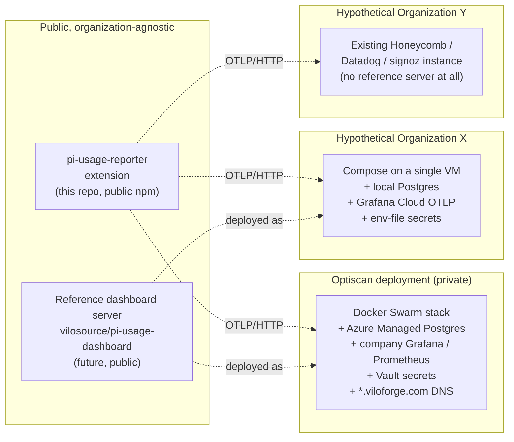
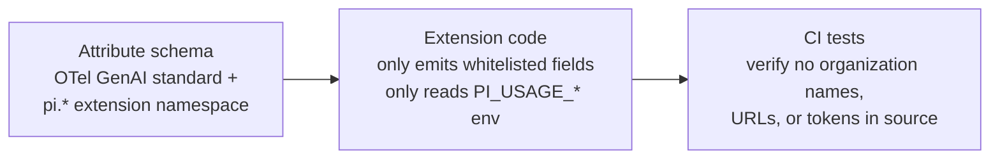

# Scope & Deployment Strategy

**Document type:** Strategy
**Status:** Accepted
**Date:** 2026-05-08
**Owner:** Platform / DevEx
**Workspace:** `pi-dev`
**Related:** [`pi-extensions-monorepo-STRATEGY.md`](pi-extensions-monorepo-STRATEGY.md), [`dashboard-backend-STRATEGY.md`](dashboard-backend-STRATEGY.md)

## 1. Decision

The pi-usage system is **three separate artifacts**, intentionally split by audience and lifecycle:

1. **The extension** — `@vilosource/pi-usage-reporter`. A pi extension that emits OpenTelemetry over OTLP/HTTP to a configurable endpoint. Organization-agnostic. Distributed via public npm. Lives in this repo.
2. **The reference dashboard server** — a separate open-source project providing a turnkey OTLP-compatible backend (Collector pipeline, Postgres schema, API, SPA, Grafana dashboard JSON). Organization-agnostic. Distributed as multiple deployment recipes (Docker Compose, Docker Swarm, Helm, bring-your-own-Postgres). To live in a future `vilosource/pi-usage-dashboard` repo.
3. **Optiscan's private deployment** — the actual running infrastructure that consumes the extension's data: Docker Swarm stack, Azure Managed Postgres, company Grafana / Prometheus, Vault-managed secrets, Optiscan-specific DNS, IdP, team mappings. Private. Lives in an Optiscan-internal repo. **Out of scope for this strategy and for the extension's design.**



**The extension speaks OTLP and reads config files. That is its entire surface.** Whatever speaks OTLP at the other end works.

## 2. Why three artifacts and not one

We considered building this as a single product — one repo, one deliverable, one design. Rejected because:

1. **Different audiences.** Every developer at every organization that uses pi installs the extension. Only organizations that want our specific dashboard install the reference server. Only Optiscan touches Optiscan's deployment. Coupling them couples the audiences too.
2. **Different release cadences.** The extension changes when pi-mono's hook surface changes or when the OTel GenAI conventions evolve. The reference server changes when its UX or schema changes. Optiscan's deployment changes when company infrastructure changes (DNS, certs, IdP rotation). Coupling them forces lockstep releases that none of them benefit from.
3. **Different licensing / IP postures.** Extension and reference server are MIT-licensed, public, contribute-back-friendly. Optiscan's deployment contains internal hostnames, team mappings, secret paths, and possibly customer-affecting policy — none of which belongs on public GitHub.
4. **Different user expectations.** The extension must work standalone (a developer can `pi install` it and emit to whatever they have, including a personal Honeycomb account). The reference server must be deployable by anyone with Docker. Optiscan's deployment can assume Vault, Traefik, WireGuard, Swarm — none of which a third party will have.
5. **OTel's whole value proposition is decoupling.** Bundling the extension to a specific backend would discard the main reason to use OTel in the first place.

## 3. What the extension knows about backends

**Nothing specific.** The extension knows:

- An endpoint URL (or a comma-separated list).
- A bearer token (or arbitrary headers).
- A handful of optional knobs (batch interval, redaction toggle, environment tag).

It does not know whether the endpoint is the reference server, Honeycomb, Grafana Cloud, or a `nc -l` listener for debugging. This is enforced at three levels:



If anyone ever proposes adding "Optiscan", "viloforge.com", an Azure-specific URL, or any other hard-coded organizational reference to the extension's source, the answer is no.

## 4. What the reference server knows about deployments

**Nothing specific.** Same principle, applied to the server.

The reference server is a small set of components — Collector config, Postgres migrations, API, SPA, Grafana JSON. Every organization-specific value is a config knob:

| Knob | Env var | Why pluggable |
|---|---|---|
| Database connection | `DATABASE_URL` | works with Azure Managed PG, AWS RDS, GCP Cloud SQL, on-prem Postgres, or sqlite for solo |
| Mimir / Prometheus remote-write target | `MIMIR_REMOTE_WRITE_URL` (optional) | self-hosters run Prometheus locally; orgs with existing Grafana wire to theirs; solo users skip metrics entirely |
| Tempo endpoint | `TEMPO_OTLP_ENDPOINT` (optional) | same |
| IdP | `OIDC_ISSUER_URL`, `OIDC_CLIENT_ID`, `OIDC_CLIENT_SECRET` | Entra / Google / Okta / Auth0 / Keycloak — anything OIDC |
| Public URL | `PUBLIC_URL` | what the API advertises, what's in the OAuth callback |
| Token signing key | `JWT_SECRET` | standard 12-factor |
| Bearer-token list (Collector ingest auth) | `OTEL_INGEST_TOKENS` | Vault for Optiscan, env file for others |

The reference server ships **multiple deployment recipes**, and an organization picks the one that matches their environment:

```
deploy/
├── docker-compose/      single VM, sqlite-or-Postgres, easiest path
├── docker-swarm/        multi-node Swarm with Traefik labels
├── helm/                k8s
└── managed-pg/          bring-your-own Postgres (Azure / RDS / Cloud SQL)
```

Optiscan's deployment uses `docker-swarm/` + `managed-pg/`. A hobbyist uses `docker-compose/`. An org on EKS uses `helm/`. **Same software, same schemas, different recipe.**

## 5. The reference server is optional

It's worth being explicit: an organization can use the extension **without** our reference server at all.

| If they have... | They... |
|---|---|
| Honeycomb | point `PI_USAGE_ENDPOINT` at the Honeycomb OTLP ingest. Get traces and metrics in Honeycomb. No reference server needed. |
| Grafana Cloud | point at the Grafana OTLP gateway. Get metrics in Mimir, traces in Tempo. No reference server needed. |
| Datadog | point at Datadog's OTLP intake. Same. |
| Self-hosted Prometheus + a homemade OTLP receiver | point at it. Same. |
| Nothing yet, want our turnkey UX | deploy the reference server. |

The reference server's value is the **per-user / per-team / finance / audit** surface that none of those vendors ship out of the box (Grafana Cloud doesn't enforce per-row RBAC; Honeycomb isn't designed for finance reconciliation; etc.). Anyone who already has those needs covered by another tool should not deploy the reference server — they should just point the extension at their existing setup.

## 6. The Optiscan deployment

Out of scope for this repo and the reference server. Captured here only to document **what is not part of the public artifacts:**

- The actual Swarm stack file with our service names, replica counts, placement constraints
- Vault paths for secrets
- Traefik labels with our hostnames
- Azure Managed Postgres connection details
- Connection to *our* company Grafana / Mimir / Tempo
- Our specific IdP (Entra) configuration
- Our team mappings (which user belongs to which team)
- Our budget thresholds
- Our DNS (`*.viloforge.com`)
- Our certificate strategy (Vault Agent + wildcard cert)
- Our DR runbook for this stack

These live in an Optiscan-internal deployment repo. The reference server's `deploy/docker-swarm/` recipe is the **starting point** they are derived from; the private repo is a thin wrapper that fills in the values via Vault and the existing Swarm conventions.

The decision QA that follows this strategy doc (D2-D6 in conversation) settles **Optiscan-specific** values for the private deployment. Those decisions do not affect the extension or the reference server design.

## 7. Decisions this document commits to

1. **Three artifacts**, separated by audience: extension (public, organization-agnostic), reference dashboard server (public, organization-agnostic), Optiscan deployment (private, organization-specific).
2. **The extension knows nothing about any specific backend.** Endpoint and headers are config-driven; it speaks OTLP and only OTLP.
3. **The reference dashboard server knows nothing about any specific deployment.** Every organization-specific value is an env-var-driven knob.
4. **The reference server is optional.** Organizations with existing OTLP backends (Honeycomb, Grafana Cloud, Datadog, self-hosted) can use the extension directly against those.
5. **The reference server ships multiple deployment recipes.** Docker Compose, Docker Swarm, Helm, bring-your-own-Postgres. An organization picks the recipe that matches their environment.
6. **No organization names, URLs, hostnames, or tokens are hardcoded** in either the extension or the reference server. CI in both repos validates this.
7. **Optiscan-specific deployment lives in a private Optiscan repo.** It references the public artifacts as inputs; it never modifies them.
8. **The reference server is a future repo** (`vilosource/pi-usage-dashboard`). Its design will live in that repo. The current design doc in this repo is for the extension only; the dashboard sections describe the reference server's *external contract* (what the extension expects on the other end of the OTLP wire) but not its internal implementation.
9. **The phased delivery in the design doc** is now Optiscan's phased delivery — not the extension's, and not the reference server's. The extension itself ships when it works; the reference server ships when it works; how Optiscan rolls them out is its own concern.
10. **Anywhere a public document appears to be making an Optiscan-specific assumption, it is a documentation bug** to be filed and fixed.
